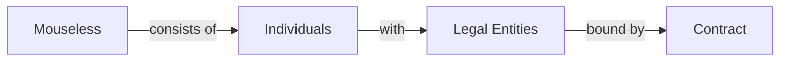

We like to develop software, together.

We are a software development collective that is centered around its engineers.
We develop tailor-made software and re-engineer legacy code to help our
customers to focus their development teams on their core business concerns.

We are, and will always be, a small team that consists of 3-7 software
engineers.

## Why a collective?

People over business.

Teams are centered around their people. This property alone is a constant
invitation for any team to be communicative, productive and creative.

A business centric organization is centered around its core product vision. This
means when a company have to choose between the product and the people, it will
choose its core product over the people.

We think that this introduces a direct conflict with the idea of being a team.
So we've chosen to be a collective.

One of our engineers negotiates with a customer and brings their needs to the
team. The individual who negotiates with the customer becomes the _Single Point
of Contact_ and manages all the communication and operations, while we work as
Mouseless and deliver software increments continuously.

## The Team

Exclusive in expertise, inclusive in conditions.

Our [team][github-people] consists of independent engineers that are committed
to work with respect to our [process](./process.md). Each engineer has a
contribution rate that fits to their seniority in the field.

### Join Us

If you are a new graduate and looking for opportunities, we have this _fresh
engineer_ program. You join us as a new graduate. We teach you our way, assign
you with real customer tasks and regraduate you after 2 years of hard work.

Or if you are a software engineer and you feel like home when you read all of
the things in this site, and liked what you've seen in our [GitHub][github], let
us know.

Reach out from [here][mail].

## The Culture

_We strive for excellence._

We view perfection as doing the best we can each day, understanding that it's a
dynamic goal, not an unchanging ideal. With this perspective, we pursue
excellence in our work every day.

_We welcome the unconventional._

It is our path to evolution. It involves trying and experimenting, embracing new
approaches even when they make us feel strange and uneasy. We are perfectly fine
with stepping out of the comfort zone, inviting the unconventional.

_We love our profession._

As software engineers, we constantly debate over better and cleaner ways to
write code, even after its delivery. It's not just about the end product; it's
the inherently elegant and intriguing nature of the work itself that keeps us
engaged.

_We are efficient._

We prioritize quality over speed, understanding that haste can result in costly
errors. To achieve a balance between quality and productivity, we employ
effective scope management and incremental delivery.

[github-people]: https://github.com/orgs/mouseless/people
[github]: https://github.com/mouseless
[mail]: mailto:connect@mouseless.codes
