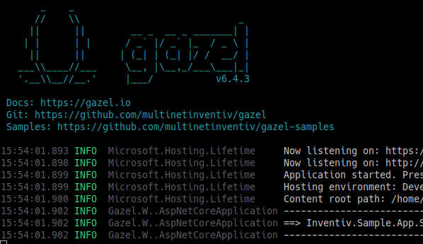
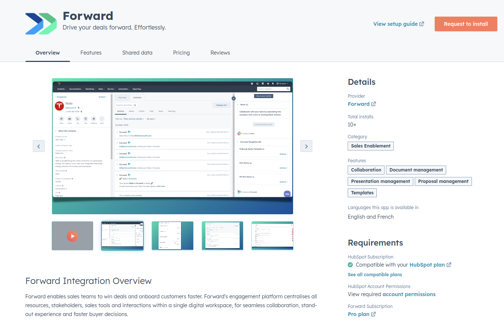

::block

:::banner

# Building value, together

Explore our real-world success stories and discover how we've made a difference
for our clients.

:::

::

::block{color=black}

:::columns{:itemWidths='["100%", "100ch"]'}

#text

:include{content="contents/tech-stacks/inventiv.md"}

## Inventiv - Multinet | Up

We've built [Inventiv][]'s internal software development framework [Gazel][] and
an open source service framework [Routine][] for the customer.

::::bullet-list

- __Industry__: Fintech
- __Project Management__: GitHub, Azure DevOps, Microsoft Teams

::::

::::details

:::::summary

:link-button{text="Read more..."}

:::::

[Inventiv][] is the technology subsidiary of [Multinet | Up][], specializing in
payment technology. They have a strong in-house software development culture,
providing us with the opportunity to explore innovative ways to develop
software. This led us to create their backend framework, [Gazel][], and their
service framework, [Routine][], both in .NET.

The majority of Inventiv's software runs on Gazel, efficiently processing
millions of daily payment transactions for _Multinet | Up_ card users.

We were directly responsible for Gazel's entire development. Our tasks included
introducing new features, planning and managing releases, researching and
implementing the latest .NET advancements into the framework, managing
technology upgrades, and maintaining the framework's documentation.

### Our History

We initiated the design and development of _Multinet | Up_'s framework, with the
first version released in 2014. We've open-sourced Routine, and turn their
internal framework into the product it is today.

This 10 year journey has been invaluable in teaching us how to tackle the
challenges of creating an open-source product, for which we'll always be
grateful.

::::

#image

:::

::

::block

:::columns{:itemWidths='["100%", "100ch"]'}

#text

:include{content="contents/tech-stacks/forward.md"}

## Forward

We're building integration gateway server for [Forward][]'s web app to allow
their customers integrate with CRM and more.

::::bullet-list

- __Industry__: SalesTech
- __Integrated Systems__: HubSpot, Zapier
- __Project Management__: GitHub, Slack

::::

::::details

:::::summary

:link-button{text="Read more..."}

:::::

[Forward][] is a sales enablement tool that empowers B2B companies to enhance
their buyer engagement through digital sales rooms, shared with a single link.

Their product requires lots of integrations, particularly with CRM systems. This
is where we came in. Currently, we are helping them establish an integration
gateway, ensuring they can maintain their focus on enhencing the seller and
buyer experience they provide.

### Our History

We have collaborated on several projects with the Forward team, with some dating
back to 2015, even before our collective was born. With this strong
relationship, we are happy to support Forwardians in achieving their goals.

::::

#image

:::

::

:block{content="contents/lets-meet.md" color=black}
:block{content="contents/tedious-work.md"}
:block{content="contents/balancing-quality.md" color=black}
:block{content="contents/mouseless-in-action.md"}
:block{content="contents/our-collective.md" color=black}

[Flopal]: https://flopal.com.tr/en-US/Home/Index
[Forward]: https://dealforward.com/
[Gazel]: https://gazel.io/
[Inventiv]: https://inventiv.com.tr/en/home
[Multinet | Up]: https://multinet.com.tr/
[Routine]: https://github.com/multinetinventiv/routine
