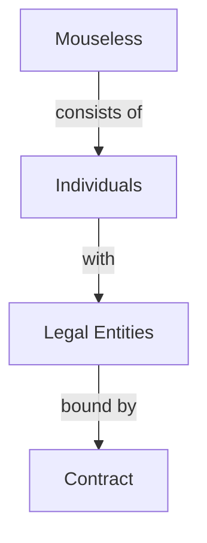
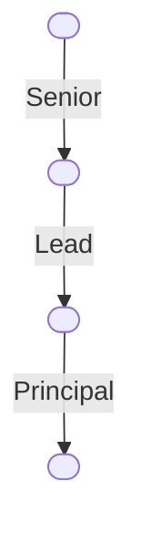

::block

:::box-layout

::::box

## **We** love to develop software, together

We are a software development collective, connected through our craft. Our
collective is a team of 3-7 software engineers guided by our people-centric
philosophy. We prioritize excellence and efficiency, focusing on delivering
quality work collaboratively.

::::

:::

::

::block{color=black}

:::banner

## Our Culture

:::

:::box-layout{display=stack itemWidth="48%"}

#excellence

::::box{imageAlign="left"}
---
image: //mouseless.github.io/brand/assets/logo/svg/logo-mark-primary.svg
---

:::::banner

### **We** strive for excellence

:::::

We view perfection as doing the best we can each day, understanding that it's a
dynamic goal, not an unchanging ideal. With this perspective, we pursue
excellence in our work every day.

::::

#unconventional

::::box{align="left" imageAlign="left"}
---
image: //mouseless.github.io/brand/assets/logo/svg/logo-mark-primary.svg
---

:::::banner{align=left}

### **We** welcome the unconventional

:::::

It is our path to evolution. It involves trying and experimenting, embracing new
approaches even when they make us feel strange and uneasy. We are perfectly fine
with stepping out of the comfort zone, inviting the unconventional.

::::

#craft

::::box{align="left" imageAlign="left"}
---
image: //mouseless.github.io/brand/assets/logo/svg/logo-mark-primary.svg
---

:::::banner

### **We** love our craft

:::::

As software engineers, we constantly debate over better and cleaner ways to
write code, even after its delivery. It's not just about the end product; it's
the inherently elegant and fascinating nature of the work itself that keeps us
engaged.

::::

#efficient

::::box{align="left" imageAlign="left"}
---
image: //mouseless.github.io/brand/assets/logo/svg/logo-mark-primary.svg
---

:::::banner

### **We** are efficient

:::::

We prioritize quality over speed, understanding that rushing can result in
costly errors. To achieve a balance between quality and productivity, we employ
effective scope management and incremental delivery.

::::

#people-centric

::::box{align="left" imageAlign="left"}
---
image: //mouseless.github.io/brand/assets/logo/svg/logo-mark-primary.svg
---

:::::banner

### **We** are people-centric

:::::

We prioritize our people above all else, promoting open communication and
efficiency. With this philosophy, our collective keeps its focus on its craft
which eventually leads to excellence.

::::

::

::block

:::banner

## Our Structure

At Mouseless, we function as a cohesive software development collective. Our
structure is designed to promote collaboration and communication, aligning with
our people-centric philosophy.

:::

:::box-layout{:itemWidths='["100%", "20ch"]'}

#text

Within our collective, one of our engineers serves as the main point of contact
for a client. This _Single Point of Contact_ manages all client communications
and operations seamlessly while we, as Mouseless, focus on delivering software
increments continuously.

### Why a collective?

A collective is inherently centered around its people, creating an environment
of communication and efficiency. In contrast, a business centers on its core
product vision, emphasizing product delivery, regardless of obstacles.

When faced with an inevitable choice between the product and the people,
collectives lean toward their people, whereas businesses lean toward their
products.

Recognizing this, we've chosen to be a collective.

#chart

:::

::

::block{color=black}

:::box-layout{:itemWidths='["100%", "19ch"]'}

#content

::::banner

## Our People

We are exclusive in expertise, inclusive in participation.

::::

::::box-layout{:itemWidths='["34%", "66%"]'}

#people

We are independent engineers who are committed to work in accordance with [the
mouseless way](./how-we-work.md) where everyone has a contribution rate that
aligns with their level of experience in the field.

:people

#join

If you are an experienced software engineer and you think you align with our
principles and appreciate what you've seen on our [GitHub][github], let us know.

If you are a recent graduate seeking opportunities, consider our _Fresh
Engineer_ program. You join us as a new graduate. We'll guide you through our
way, assign you with real customer tasks, and regraduate you after two years of
dedicated work.

::::

#diagram

:::

::

[github]: https://github.com/mouseless
[mail]: mailto:connect@mouseless.codes
