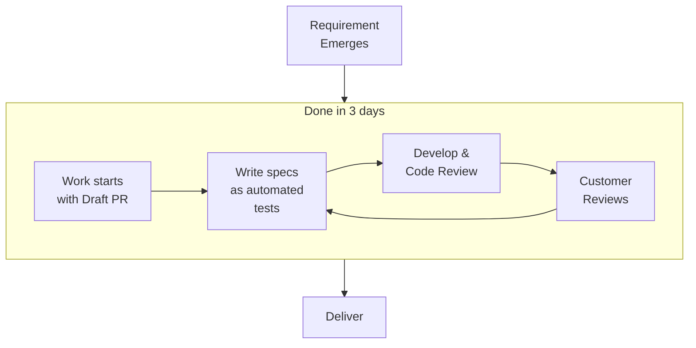

::block

:::box-layout

::::box

## **We** experiment, learn and progress

We run on a flexible, pay-as-you-go model. We prioritize timely feature
delivery, automated testing, code refactoring, and keeping technology up to date
without extra cost.

::::

:::

::

::block{color=black}

:::box-layout

#text

### Low Cost of Change

We employ __automated tests__ for robustness, engage in __constant refactoring__
to maintain code quality. We keep our technology up to date __at no extra cost__
to our clients.

#bullet

::::bullet-list

- test automation
- refactoring
- tech-stack update

::::

:::

::

::block{color=black}

:::banner

#### See in action

:::

:::box-layout{display="stack"}

#do-builds

::::box

##### Tests and Coverage

Check out one of our open source project, DO, to see how we utilize test
automation;

:link-button{to="https://github.com/mouseless/do/actions/runs/8344718124" text="See in GitHub"}

::::

#net-upgrade

::::box

##### Research Upgrades

We provide our customers with technology upgrades out of the box. Check out how
we manage tech upgrades.

:link-button{to="https://github.com/mouseless/learn-dotnet/pull/17" text="See in GitHub"}

::::

#do-net-upgrade

::::box

##### Apply Upgrades

Using our headless opinionated .NET framework we manage to easily upgrade
customer projects.

:link-button{to="https://do.mouseless.codes/release-notes/v0-6#net-upgrade" text="See in DO"}

::::

:::

::

::block

:::box-layout

#text

### Continuous Delivery

Lorem ipsum dolor sit amet, consectetur adipiscing elit. Mauris eleifend dui id
sagittis suscipit. Curabitur dignissim nisi vitae enim ultrices, ac faucibus
elit faucibus. Fusce ut tempor arcu. Aenean sit amet commodo orci, ac
sollicitudin magna.

#bullet

::::bullet-list

- 3 days of average lead-time
- no estimation -> continuous planning
- end to end CI/CD setup

::::

:::

::

::block

:::banner

#### See in action

:::

:::box-layout{display="stack"}

#freq-releases

::::box

##### Frequent Releases

Check out DO releases to see frequency of our delivery cycle;

:link-button{to="https://github.com/mouseless/do/releases" text="See in GitHub"}

::::

#lead-time

::::box

##### Lead-Time

See how we build software incrementally;

:link-button{to="https://github.com/mouseless/do/pulls?q=label%3APublish+is%3Aclosed" text="See in GitHub"}

::::

:::

::

::block{color=black}

:::box-layout

#text

### Progress Visibility

Lorem ipsum dolor sit amet, consectetur adipiscing elit. Mauris eleifend dui id
sagittis suscipit. Curabitur dignissim nisi vitae enim ultrices, ac faucibus
elit faucibus. Fusce ut tempor arcu. Aenean sit amet commodo orci, ac
sollicitudin magna.

#bullet

::::bullet-list

- __Draft PRs__ right from beginning
- Well detailed __task lists__
- Clear __commit messages__

::::

:::

::

::block{color=black}

:::banner

#### See in action

:::

:::box-layout{display="stack"}

#do-epic

::::box

##### PRs

Check out our live work right from GitHub;

:link-button{to="https://github.com/mouseless/do/pulls" text="See in GitHub"}

::::

#learn-task

::::box

##### Tasks

See how we care work descriptions and tasks;

:link-button{to="https://github.com/mouseless/learn-css/pull/2" text="See in GitHub"}

::::

:::

::

::block

:::box-layout

#text

### Cross Pollination

Our development style produces high-quality software which requires considerable
effort. To provide top-tier services that are also cost-effective, we follow a
philosophy of cross-pollination by open sourcing everything we own. This
approach ensures our clients avoid potential risks of depending on a service
provider and allows them to benefit from our total experience.

#bullet

::::bullet-list

- Open Source
- Continuous Learning

::::

:::

::

::block

:::banner

#### See in action

:::

:::box-layout{display="stack"}

#do-docs

::::box

##### DO

Check out DO, our opinionated framework for .NET;

:link-button{to="https://do.mouseless.codes" text="See DO"}

::::

#learn-nuxt

::::box

##### Learn

See how we learned, documented and use Nuxt;

:link-button{to="https://mouseless.github.io/learn-nuxt" text="Learn Nuxt"}

::::

#all-open-source

::::box

##### Open Source

See what we've open sourced so far;

:link-button{to="https://github.com/mouseless?type=public" text="See in GitHub"}

::::

:::

::

:block{content="contents/reach-out.md" color=black}

::block

:::banner

## Engagement Model

**We** are self-organized.

:::

We are a __self-managing__ team with a single point of contact assigned per
client. We operate on a __time & materials__ basis without requiring a
fixed-budget or a fixed-plan thanks to our fast response time.

::

::block{color=gray}

## Become Partner

:include{content="contents/become-partner.md"}

::

::block

### Delivery Process

::

:block{content="contents/reach-out.md" color=black}
:block{content="contents/tedious-work.md"}
:block{content="contents/our-collective.md"}
:block{content="contents/contact-us.md" color=gray}
