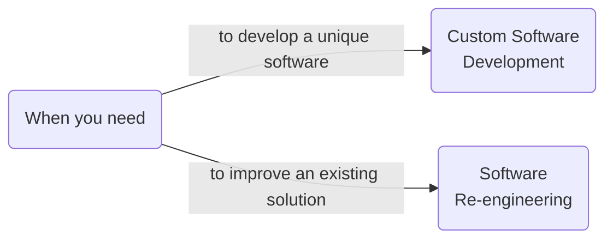
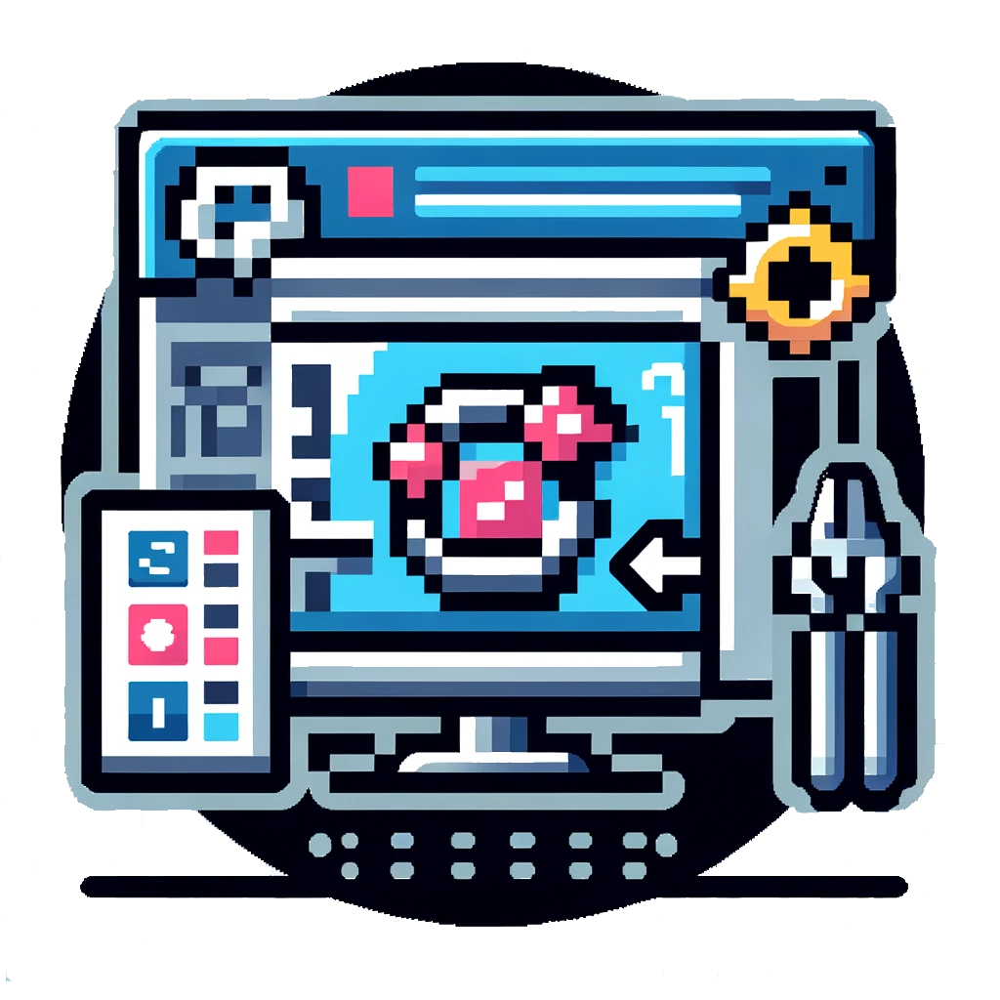

::block

:::banner

### We offer;
# Software Development
# as a Service

We build long-term partnerships to take __full responsibility__ of in-house
software that you'd rather outsource.

:::

::

::block{color=black}

::

::block

:::banner

## Custom Software Development

We provide an agile, self-managing software development team to align with your
business demands.

:::

:::columns{:itemWidths='["85%", "15%"]'}

#text

If you struggle to keep your team's capacity aligned with your business demands,
we offer an established self-managing software development team. As a team that
embraces agile software development practices, we eagerly tackle any engineering
challenge.

At Mouseless, we've designed our collective to be centered around the software
engineering profession. This environment naturally encourages us to research,
experiment, and share our learnings with our customers.

#image

:::

:br
:br

:::banner

## Software Re-engineering

We offer our expertise to update and maintain your legacy in-house software.

:::

:::columns{:itemWidths='["15%", "85%"]'}

#image

#text

If you develop an in-house software, it's likely to become outdated and miss out
essential technology upgrades. Organizations naturally prioritize their business
challenges over technical needs which creates a persistent problem that requires
professional attention.

We're more than willing to offer our expertise to take full responsibility for
such systems. It enables your workforce to focus on business concerns while
granting us an opportunity to address engineering challenges.

:::

::

:block{content="contents/become-partner.md" color=black}
:block{content="contents/lets-meet.md"}
:block{content="contents/explore-long-term.md" color=black}
:block{content="contents/balancing-quality.md"}
:block{content="contents/our-collective.md" color=black}
