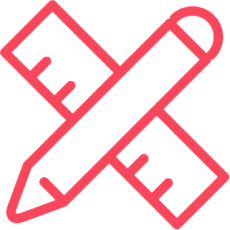

::block

:::banner

### We Offer;
# Staff Augmentation

We take __full responsibility__ for software systems that you'd rather
outsource. This allows you to maintain your focus on your core business
concerns.

:::

::

::block{color=black}

::

::block

:::banner

## Custom Software Development

We provide an agile, self-managing software development team to align with your
business demands.

:::

:::box-layout{:itemWidths='["85%", "15%"]'}

#text

If you struggle to keep your team's capacity aligned with your business demands,
we offer an established self-managing software development team. As a team that
embraces agile software development practices, we eagerly tackle any engineering
challenge.

At Mouseless, we've designed our collective to be centered around the software
engineering profession. This environment naturally encourages us to research,
experiment, and share our learnings with our customers.

#image

:::

:br
:include{content="contents/become-partner.md"}

::

:block{content="contents/reach-out.md" color=black}

::block

:::banner

## Software Re-engineering

We offer our expertise to update and maintain your legacy in-house software.

:::

:::box-layout{:itemWidths='["85%", "15%"]'}

#text

If you have a custom-developed software, it's probable that this software has
eventually become outdated and miss out essential technology upgrades. This
occurs because organizations naturally prioritize their business challenges over
technical needs which creates a persistent problem that requires professional
attention.

We're more than willing to offer our expertise to take the full responsibility
for such systems. Through this approach, we aim to create a win-win scenario. It
enables your workforce to focus on business concerns while granting us an
opportunity to address engineering challenges.

#image

:::

:br
:include{content="contents/become-partner.md"}

::

:block{content="contents/reach-out.md" color=black}
:block{content="contents/balancing-quality.md"}
:block{content="contents/built-value.md"}
:block{content="contents/our-collective.md" color=black}
