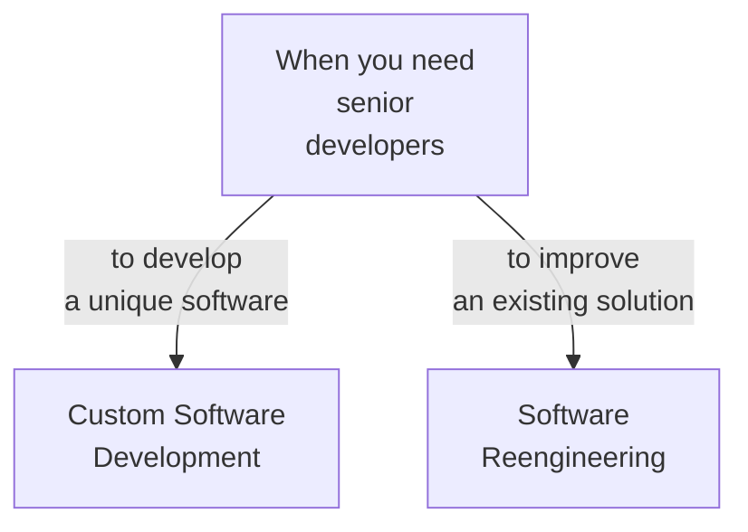

::block

:::box-layout

::::box

### We Offer Staff Augmentation

We position ourselves as a __staff augmentation__ service provider, offering
full responsibility for software systems that you'd rather outsource. This
allows you to maintain your focus on your core business concerns.

::::

:::

::

::block{color=black}

:::banner

## **Our** Services

:::

::

::block

:::box-layout

#csd

::::box

### Custom Software Development

We advise our clients to prioritize core product features and leverage pre-built
software solutions for non-core needs. While this approach suits startups and
early-stage products, there comes a point where custom development becomes
essential, even for complementary functions like notification services and
integration systems.

That's where we come in. We offer our services to ensure you can maintain your
focus on core business concerns without compromising your custom requirements.

We function as a self-managing software engineering team, handling the entire
development process from design and planning to implementation, with all
technical aspects, including maintenance and upgrades, professionally managed
out of the box to ensure a seamless experience for you.
how we can assist you.

::::

#re

::::box

# Re-engineering

If you have custom-developed software serving as a secondary system, it's
probable that this software may eventually become outdated and miss out on
essential technology upgrades. This occurs because organizations naturally
prioritize their core business challenges over technical needs of auxiliary
systems. This creates a persistent problem that requires professional attention.

We're more than willing to offer our expertise to take the full responsibility
for such systems. Through this approach, we aim to create a win-win scenario. It
enables your workforce to focus on core business concerns while granting us an
opportunity to address engineering challenges.

::::

:::

::

:block{content="contents/reach-out.md" color=black}

::block

:::banner{:hr=false align=left}

## **Our** Approach

:::

:::box

::::bullet-list

- Low Cost of Change
- Continuous Delivery
- Progress Visibility
- Cross Pollination

::::

:::

::

---

::block

:::banner{:hr=false align=left}

## What's Next

:::

:include{content="contents/become-partner.md"}

::

:block{content="contents/reach-out.md" color=black}
:block{content="contents/built-value.md"}
:block{content="contents/our-collective.md"}
:block{content="contents/contact-us.md" color=gray}
